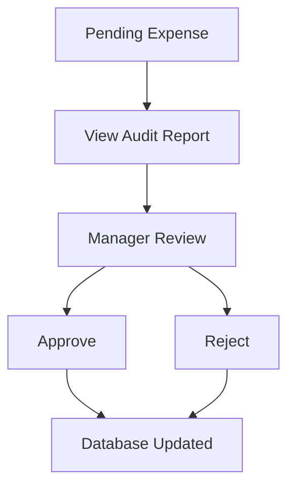

## Dashboard Screenshot Architecture

```mermaid
 flowchart TD

A[Pending Expense]

A --> B[View Audit Report]

B --> C[Manager Review]

C --> D[Approve]

C --> E[Reject]

D --> F[Database Updated]

E --> F
```
