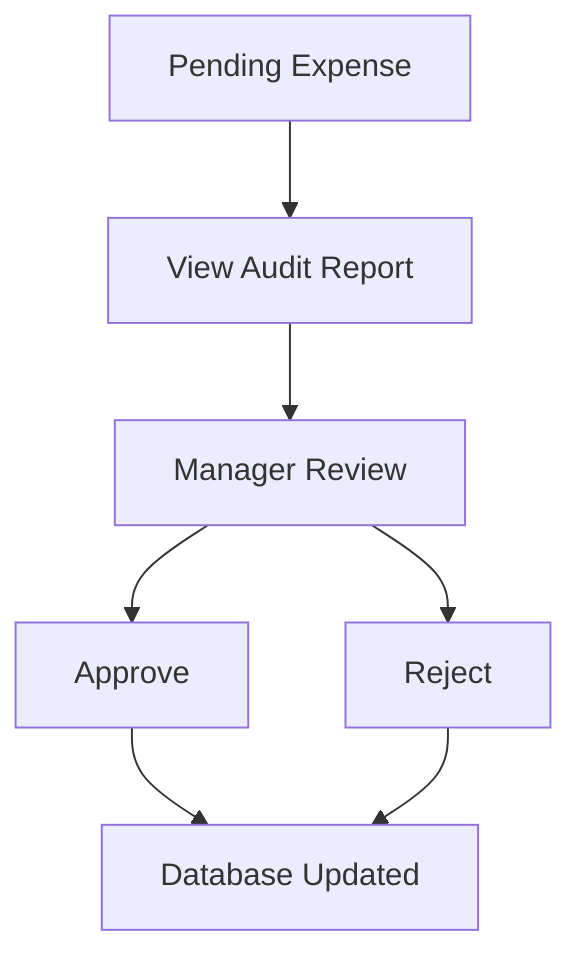

## Dashboard Screenshot Architecture

## Running the Dashboard
~~~bash
uvicorn dashboard.app:app --reload
~~~

**Open:**
~~~bash
http://localhost:8000
~~~

## Demo Workflow

**Expense Submitted**
~~~bash
{
  "amount": 500,
  "submitter": "Bob",
  "category": "Meals",
  "description": "Conference dinner"
}
~~~

